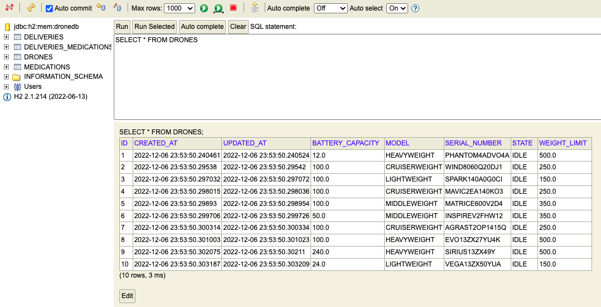
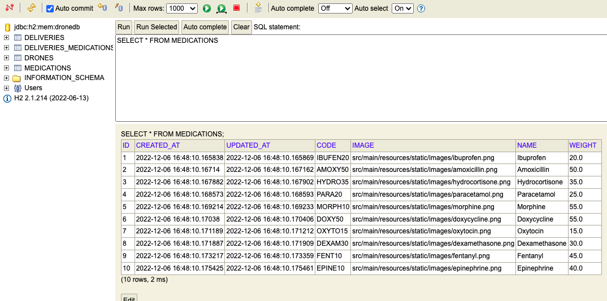
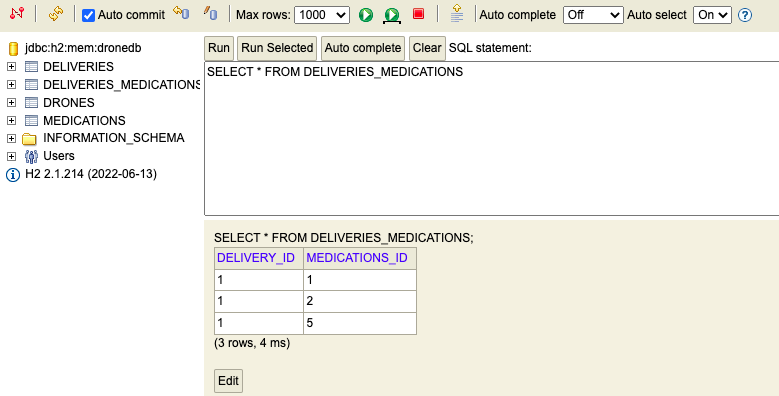
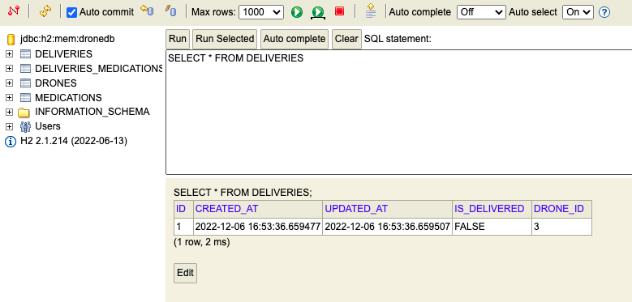
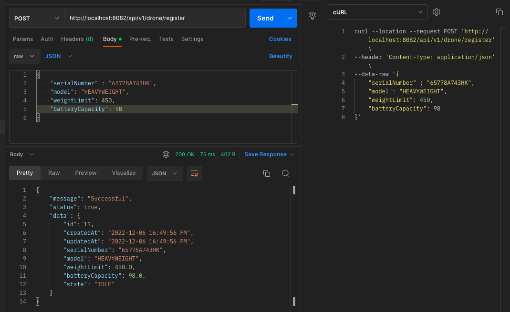
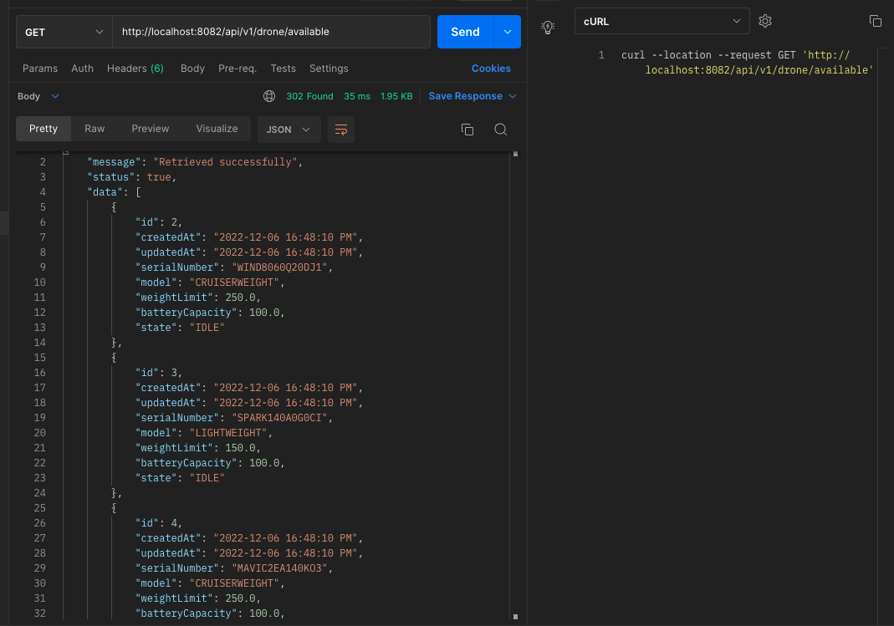
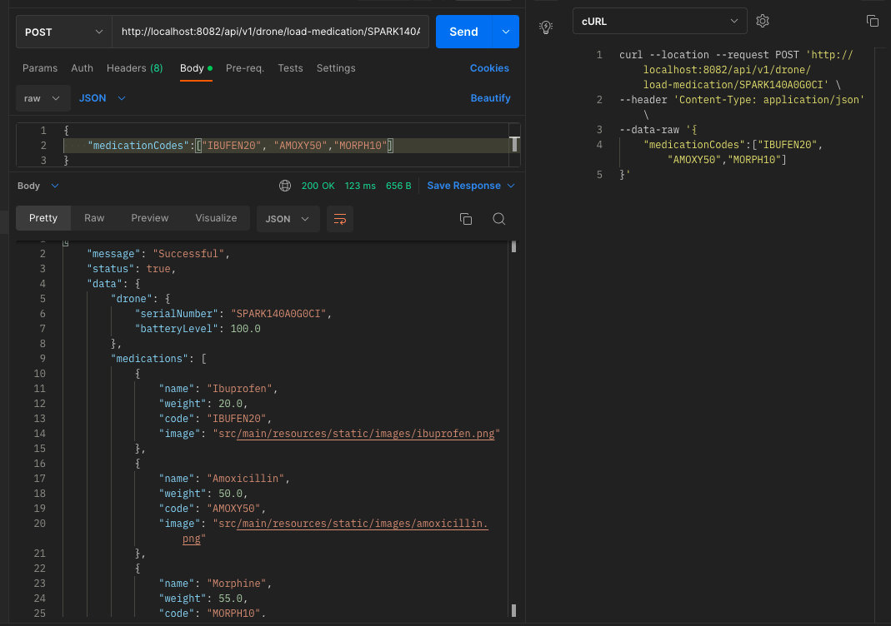
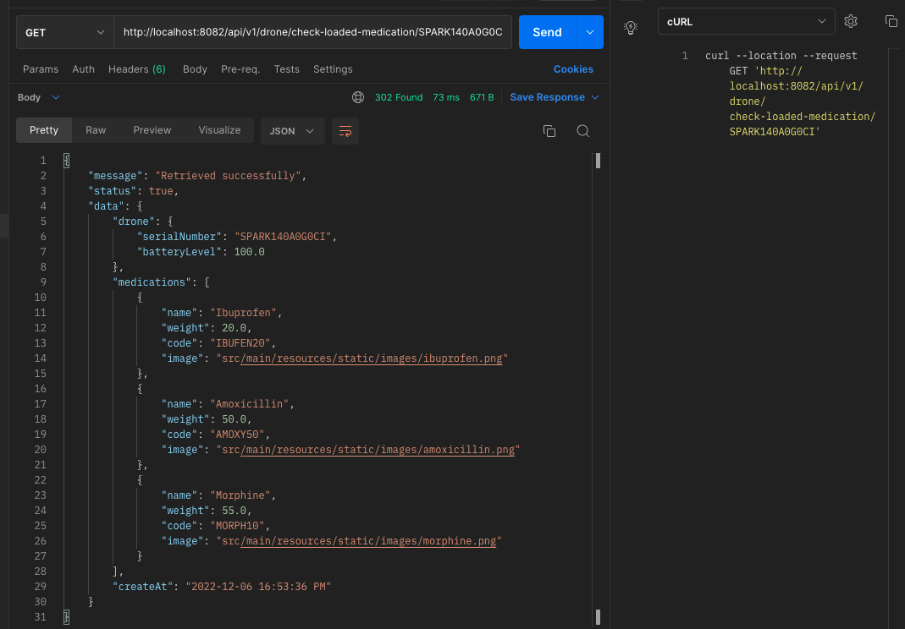
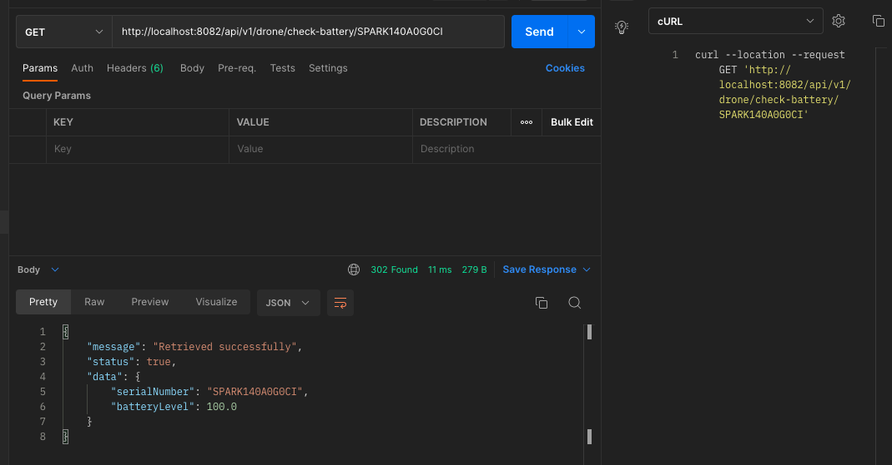
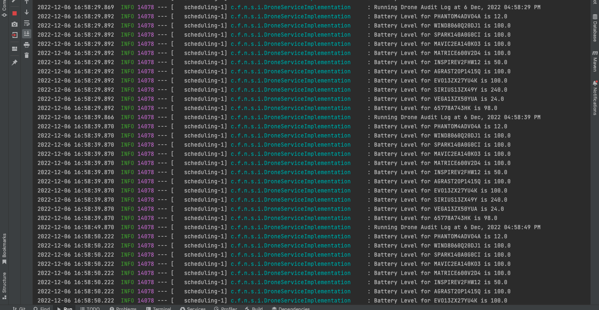

## Drones

[[_TOC_]]

---

:scroll: **START**


### Introduction

There is a major new technology that is destined to be a disruptive force in the field of transportation: **the drone**. Just as the mobile phone allowed developing countries to leapfrog older technologies for personal communication, the drone has the potential to leapfrog traditional transportation infrastructure.

Useful drone functions include delivery of small items that are (urgently) needed in locations with difficult access.

---

### Task description

We have a fleet of **10 drones**. A drone is capable of carrying devices, other than cameras, and capable of delivering small loads. For our use case **the load is medications**.

A **Drone** has:
- serial number (100 characters max);
- model (Lightweight, Middleweight, Cruiserweight, Heavyweight);
- weight limit (500gr max);
- battery capacity (percentage);
- state (IDLE, LOADING, LOADED, DELIVERING, DELIVERED, RETURNING).

Each **Medication** has:
- name (allowed only letters, numbers, ‘-‘, ‘_’);
- weight;
- code (allowed only upper case letters, underscore and numbers);
- image (picture of the medication case).

Develop a service via REST API that allows clients to communicate with the drones (i.e. **dispatch controller**). The specific communicaiton with the drone is outside the scope of this task.

The service should allow:
- registering a drone;
- loading a drone with medication items;
- checking loaded medication items for a given drone;
- checking available drones for loading;
- check drone battery level for a given drone;

> Feel free to make assumptions for the design approach.

---

### Requirements

While implementing your solution **please take care of the following requirements**:

#### Functional requirements

- There is no need for UI;
- Prevent the drone from being loaded with more weight that it can carry;
- Prevent the drone from being in LOADING state if the battery level is **below 25%**;
- Introduce a periodic task to check drones battery levels and create history/audit event log for this.

---

#### Non-functional requirements

- Input/output data must be in JSON format;
- Your project must be buildable and runnable;
- Your project must have a README file with build/run/test instructions (use DB that can be run locally, e.g. in-memory, via container);
- Required data must be preloaded in the database.
- JUnit tests are optional but advisable (if you have time);
- Advice: Show us how you work through your commit history.

---

### CONFIGURATION
#### Database (H2) configuration
- `spring.datasource.driver-class-name=org.h2.Driver`
- `spring.datasource.url=jdbc:h2:mem:dronedb`
- `spring.datasource.username=sa`
- `spring.datasource.password=password`

- `server.port=8082`

### BUILD AND RUN INSTRUCTIONS

Pull the project from the repository and run the following commands:
```cmd
mvn dependency:resolve
mvn compile
mvn spring-boot:run
```

#### Screenshot of the preloaded Drone data


#### Screenshot of the preloaded Medication data


#### Screenshot of the mapping between Drone and Medication data linked by Delivery ID



### API ENDPOINTS

#### 1. REGISTER DRONE
```bash
* `POST http://localhost:8082/api/v1/drone/register`

```bash
curl --location --request POST 'http://localhost:8082/api/v1/drone/register' \
--header 'Content-Type: application/json' \
--data-raw '{
    "serialNumber" : "65778A743HK",
    "model": "HEAVYWEIGHT",
    "weightLimit": 450,
    "batteryCapacity": 98
}'
```

#### Request Body
```json
{
    "serialNumber" : "65778A743HK",
    "model": "HEAVYWEIGHT",
    "weightLimit": 450,
    "batteryCapacity": 98
}
```
#### Expected Response
```json
{
  "message": "Successful",
  "status": true,
  "data": {
    "id": 11,
    "createdAt": "2022-12-06 16:49:56 PM",
    "updatedAt": "2022-12-06 16:49:56 PM",
    "serialNumber": "65778A743HK",
    "model": "HEAVYWEIGHT",
    "weightLimit": 450.0,
    "batteryCapacity": 98.0,
    "state": "IDLE"
  }
}
```
#### Screenshot of the expected response


#### 2. GET AVAILABLE DRONE FOR LOADING

* `GET http://localhost:8082/api/v1/drone/available`

```bash
curl --location --request GET 'http://localhost:8082/api/v1/drone/available'
```
#### Expected Response
```json
{
  "message": "Retrieved successfully",
  "status": true,
  "data": [
    {
      "id": 2,
      "createdAt": "2022-12-06 16:48:10 PM",
      "updatedAt": "2022-12-06 16:48:10 PM",
      "serialNumber": "WIND8060Q20DJ1",
      "model": "CRUISERWEIGHT",
      "weightLimit": 250.0,
      "batteryCapacity": 100.0,
      "state": "IDLE"
    },
    {
      "id": 3,
      "createdAt": "2022-12-06 16:48:10 PM",
      "updatedAt": "2022-12-06 16:48:10 PM",
      "serialNumber": "SPARK140A0G0CI",
      "model": "LIGHTWEIGHT",
      "weightLimit": 150.0,
      "batteryCapacity": 100.0,
      "state": "IDLE"
    },
    {
      "id": 4,
      "createdAt": "2022-12-06 16:48:10 PM",
      "updatedAt": "2022-12-06 16:48:10 PM",
      "serialNumber": "MAVIC2EA140KO3",
      "model": "CRUISERWEIGHT",
      "weightLimit": 250.0,
      "batteryCapacity": 100.0,
      "state": "IDLE"
    },
    {
      "id": 5,
      "createdAt": "2022-12-06 16:48:10 PM",
      "updatedAt": "2022-12-06 16:48:10 PM",
      "serialNumber": "MATRICE600V2D4",
      "model": "MIDDLEWEIGHT",
      "weightLimit": 350.0,
      "batteryCapacity": 100.0,
      "state": "IDLE"
    },
    {
      "id": 6,
      "createdAt": "2022-12-06 16:48:10 PM",
      "updatedAt": "2022-12-06 16:48:10 PM",
      "serialNumber": "INSPIREV2FHW12",
      "model": "MIDDLEWEIGHT",
      "weightLimit": 350.0,
      "batteryCapacity": 50.0,
      "state": "IDLE"
    },
    {
      "id": 7,
      "createdAt": "2022-12-06 16:48:10 PM",
      "updatedAt": "2022-12-06 16:48:10 PM",
      "serialNumber": "AGRAST2OP1415Q",
      "model": "CRUISERWEIGHT",
      "weightLimit": 250.0,
      "batteryCapacity": 100.0,
      "state": "IDLE"
    },
    {
      "id": 8,
      "createdAt": "2022-12-06 16:48:10 PM",
      "updatedAt": "2022-12-06 16:48:10 PM",
      "serialNumber": "EVO13ZX27YU4K",
      "model": "HEAVYWEIGHT",
      "weightLimit": 500.0,
      "batteryCapacity": 100.0,
      "state": "IDLE"
    },
    {
      "id": 9,
      "createdAt": "2022-12-06 16:48:10 PM",
      "updatedAt": "2022-12-06 16:48:10 PM",
      "serialNumber": "SIRIUS13ZX49Y",
      "model": "HEAVYWEIGHT",
      "weightLimit": 500.0,
      "batteryCapacity": 240.0,
      "state": "IDLE"
    },
    {
      "id": 11,
      "createdAt": "2022-12-06 16:49:56 PM",
      "updatedAt": "2022-12-06 16:49:56 PM",
      "serialNumber": "65778A743HK",
      "model": "HEAVYWEIGHT",
      "weightLimit": 450.0,
      "batteryCapacity": 98.0,
      "state": "IDLE"
    }
  ]
}
```
#### Screenshot of the expected response


#### 3. LOAD DRONE WITH MEDICATION

* `POST http://localhost:8082/api/v1/drone/load-medication/SPARK140A0G0CI`

```bash
curl --location --request POST 'http://localhost:8082/api/v1/drone/load-medication/SPARK140A0G0CI' \
--header 'Content-Type: application/json' \
--data-raw '{
    "medicationCodes":["IBUFEN20", "AMOXY50","MORPH10"]
}'
```

#### Request Body
```json
{
    "medicationCodes":["IBUFEN20", "AMOXY50","MORPH10"]
}
```

#### Expected Response
```json
{
  "message": "Successful",
  "status": true,
  "data": {
    "drone": {
      "serialNumber": "SPARK140A0G0CI",
      "batteryLevel": 100.0
    },
    "medications": [
      {
        "name": "Ibuprofen",
        "weight": 20.0,
        "code": "IBUFEN20",
        "image": "src/main/resources/static/images/ibuprofen.png"
      },
      {
        "name": "Amoxicillin",
        "weight": 50.0,
        "code": "AMOXY50",
        "image": "src/main/resources/static/images/amoxicillin.png"
      },
      {
        "name": "Morphine",
        "weight": 55.0,
        "code": "MORPH10",
        "image": "src/main/resources/static/images/morphine.png"
      }
    ],
    "createAt": "2022-12-06 16:53:36 PM"
  }
}
```
#### Screenshot of the expected response


#### 4. CHECK LOADED MEDICATION FOR A GIVEN DRONE

* `GET http://localhost:8082/api/v1/drone/check-loaded-medication/SPARK140A0G0CI`

```bash
curl --location --request GET 'http://localhost:8082/api/v1/drone/check-loaded-medication/SPARK140A0G0CI'
```

#### Expected Response
```json
{
  "message": "Retrieved successfully",
  "status": true,
  "data": {
    "drone": {
      "serialNumber": "SPARK140A0G0CI",
      "batteryLevel": 100.0
    },
    "medications": [
      {
        "name": "Ibuprofen",
        "weight": 20.0,
        "code": "IBUFEN20",
        "image": "src/main/resources/static/images/ibuprofen.png"
      },
      {
        "name": "Amoxicillin",
        "weight": 50.0,
        "code": "AMOXY50",
        "image": "src/main/resources/static/images/amoxicillin.png"
      },
      {
        "name": "Morphine",
        "weight": 55.0,
        "code": "MORPH10",
        "image": "src/main/resources/static/images/morphine.png"
      }
    ],
    "createAt": "2022-12-06 16:53:36 PM"
  }
}
```
#### Screenshot of the expected response


#### 5. CHECK DRONE BATTERY LEVEL FOR A GIVEN DRONE

* `GET http://localhost:8082/api/v1/drone/check-battery/SPARK140A0G0CI`

```bash
curl --location --request GET 'http://localhost:8082/api/v1/drone/check-battery/SPARK140A0G0CI'
```

#### Expected Response
```json
{
  "message": "Retrieved successfully",
  "status": true,
  "data": {
    "serialNumber": "SPARK140A0G0CI",
    "batteryLevel": 100.0
  }
}
```
#### Screenshot of the expected response


#### Screenshot of Battery Audit Log


:scroll: **END** 
